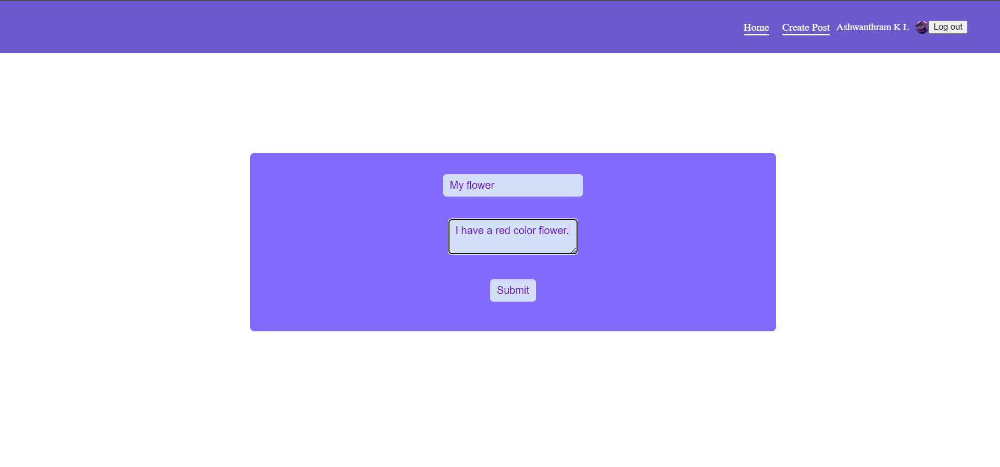

# Social media application

This is a solution to the Menu project which is a part of John Smilga's 15 JS projects tutorial.

Pages:

## Table of contents

- [Overview](#overview)
  - [The challenge](#the-challenge)
  - [Screenshot](#screenshot)
  - [Links](#links)
- [My process](#my-process)
  - [Built with](#built-with)
  - [What I learned](#what-i-learned)
- [Author](#author)

## Overview

### The challenge

Users should be able to:

- Signup/login into their google accounts
- View Posts Created by them and other users
- Create Posts.
- Like and Unlike posts.

### Screenshot

#### Home Page

#### Create Post Page

### Links

- Solution URL: [Solution URL](https://github.com/AshwanthramKL/social-media-app)
- Live Site URL: [Live site URL](https://social-media-react-91b94.web.app/)

## My process

### Built with

- Semantic HTML5 markup
- CSS custom properties
- Javascript
- React
- Firebase

### What I learned

This project helped me learn and practice various concepts of React and Firebase as follows:

- Hooks
- Components
- State Management
- React Router
- Firebase Collections
- Firebase Query

## Author

- Website - [MARTIALEAGLE](https://github.com/AshwanthramKL)
- Frontend Mentor - [@AshwanthramKL](https://www.frontendmentor.io/profile/AshwanthramKL)
- Twitter - [@AshwanthramKL](https://www.twitter.com/AshwanthramKL)
